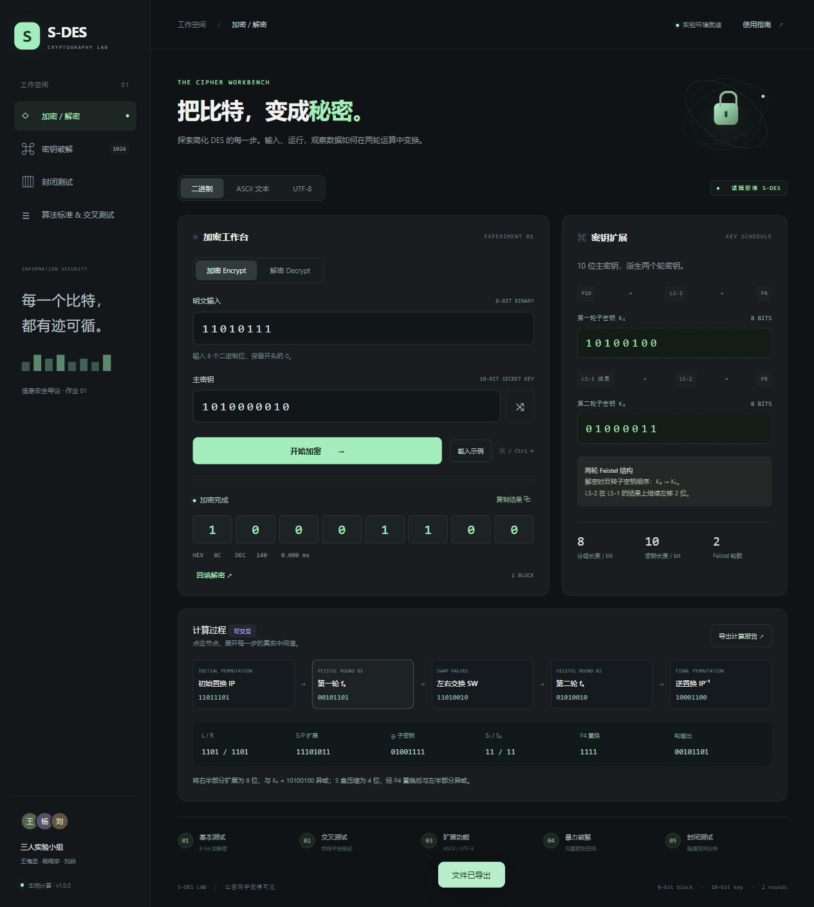

# S-DES Lab · 简化 DES 交互实验室

信息安全导论课程作业。组员：**王海丞、杨翔宇、刘焱**。

实现课程指定的 S-DES 修改版，提供浏览器交互 GUI、ASCII / UTF-8 字符串加解密、完整密钥搜索与碰撞分析。深色实验台、逐轮计算过程、后台运算、移动端布局。

**[在线体验 S-DES Lab](https://wang67681-crypto.github.io/sdes-lab/)**



## 运行

安装 Node.js 20 或更高版本，在项目根目录执行：

```sh
npm start
```

打开 http://127.0.0.1:4173 。无需安装运行依赖。请通过 HTTP 服务运行，以启用 ES Module 和 Web Worker。

```sh
npm test          # 全部 262,144 个明文 / 密钥组合的可逆性与功能测试
npm run verify   # 需 Python 3：独立实现交叉验证，并生成五关实测报告
npm run build    # 输出 dist/，可部署到任意静态网站服务器
```

## 五关功能

| 关卡 | 实现 |
| --- | --- |
| 基本测试 | 8 位明文 / 密文，10 位密钥，逐轮计算轨迹、密钥扩展、回填解密 |
| 交叉测试 | 独立 Python 参考实现、JSON 测试向量导入导出与自动比对 |
| 扩展功能 | ASCII 逐字节加解密；额外支持 UTF-8 中文 / emoji；Hex 与原始字节显示 |
| 暴力破解 | 一个或多个已知明密文对，完整搜索 1024 个密钥，全部候选、时间戳和实际耗时 |
| 封闭测试 | 固定明文密钥碰撞热力图；全部 256 明文穷举、完整报告导出 |

课程参数与常见教材版本不同，**以课程文档完整 S-box2 为准**。参考向量：明文 `11010111`，密钥 `1010000010`，密文 `10001100`；K₁ = `10100100`，K₂ = `01000011`。

## 文档与证据

- [用户指南](docs/USER-GUIDE.md)
- [开发手册与 API](docs/DEVELOPMENT.md)
- [五关测试报告](docs/TEST-REPORT.md)
- [界面验收](docs/UI-QA.md)
- [原始测试数据](docs/test-results.json)
- [独立 Python 实现](reference/sdes.py)
- [破解计时动图](docs/bruteforce.gif)

独立参考实现测试不等于其他小组的真实组间测试；导入其他小组向量后可完成比对。

## 静态部署

本仓库已配置 GitHub Pages 从 `main` 分支根目录自动发布，`.nojekyll` 保持原样静态托管。每次推送会触发算法验证，网站随分支更新。构建产物为 `dist/`，所有路径都为相对路径，适用于仓库子路径。

另附可选手动 Actions 发布工作流；若采用该方式，需在 Settings → Pages 中将 Source 改为 GitHub Actions，再运行 Deploy Pages。

[课程要求](https://shimo.im/docs/m5kvdlMaKvcENy3X/) · 截止时间：2026-10-08 23:00（北京时间）。

S-DES 为教学算法；本应用不包含账号、云端输入保存或外部计算服务。
