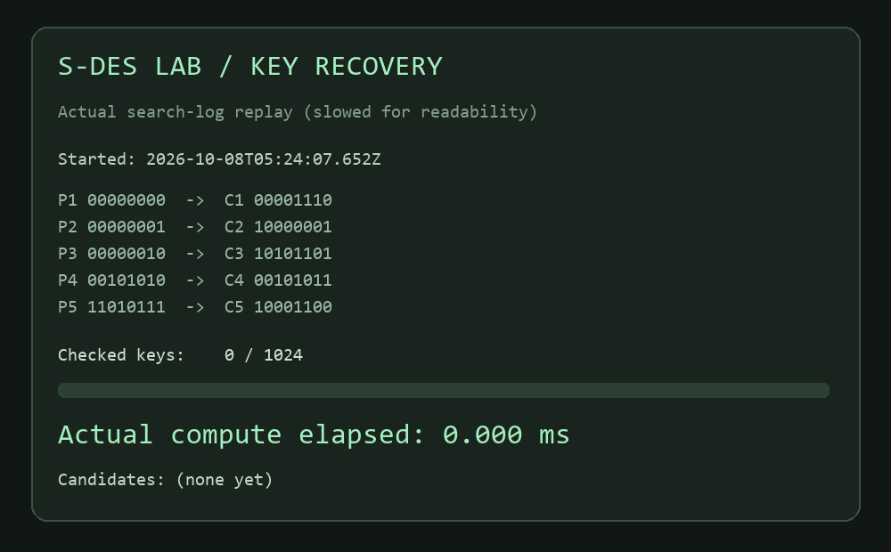

# 五关测试报告

组员：王海丞、杨翔宇、刘焱。生成时间：2026-10-08T05:24:04.659Z（UTC；北京时间 UTC+8）。环境：win32 / Node v24.19.0。本报告由 `npm run verify` 根据实际计算自动生成。

## 第 1 关：基本测试

8-bit 明文 `11010111`、10-bit 密钥 `1010000010`，加密得到 `10001100`，解密恢复原文。K₁=10100100，K₂=01000011。全部 **262,144** 个明文/密钥组合加密后解密均恢复原文。输入位数与字符验证见 `tests/sdes.test.mjs`。

## 第 2 关：交叉测试

JavaScript 使用整数位运算；独立 Python 实现使用列表与逐位运算。两个实现比较全部 **262,144** 个输入组合，**0** 项不一致。完整映射 SHA-256：`a186119069b519c40c4742e60ca459a5d6066656323f659607be54c5b3c5c19e`。

石墨课程文档完整给出 S-box2 的公式与二进制表格，两者一致：`[[0,1,2,3],[2,3,1,0],[3,0,1,2],[2,1,0,3]]`。JavaScript 和独立 Python 实现均采用这 16 项参数。

这是独立实现的一致性测试，**尚未取得其他真实小组的测试结果**。组间验证可在 GUI 导入对方 JSON，或将 [256 组向量](cross-vectors.json) 发给对方；其结果不能以此独立验证代替。

## 第 3 关：扩展功能

ASCII 字符串 `Hello, S-DES!` 的 Hex 密文为 `C4 F8 0D 0D 2F 99 62 4F 36 5F 50 4F 29`，解密原样恢复。额外验证控制字符与全部 128 个 ASCII 码。UTF-8 验证中文组员姓名与 emoji：王海丞 · 杨翔宇 · 刘焱 🔐。空字符串、非法 Hex、错误位数均有测试。原始密文字节可为不可打印字符，GUI 同时提供可复制 Hex 和原始字符显示。

## 第 4 关：暴力破解

开始时间：2026-10-08T05:24:07.652Z；结束时间：2026-10-08T05:24:07.655Z。完整遍历 **1024** 个密钥，实际计算耗时 **2.030 ms**。

| 明文 | 密文 |
| --- | --- |
| 00000000 | 00001110 |
| 00000001 | 10000001 |
| 00000010 | 10101101 |
| 00101010 | 00101011 |
| 11010111 | 10001100 |

只使用第一对时的候选：`1000110110`、`1001111110`、`1010000010`、`1011001010`。使用全部五对后的候选：`1010000010`、`1011001010`。返回所有候选，不提前在首次匹配处停止。

动图由实际搜索日志生成，逐帧标注原始累计计算耗时；播放时放慢以便阅读，动图播放时长不等于计算耗时。可运行 `python scripts/render-demo.py` 复现。

## 第 5 关：封闭测试

对明文 `11010111`，1024 个密钥产生 **240** 个不同密文，最大 **12** 个密钥映射到同一密文。一个具体例子：密文 `10111100` 对应密钥 `0100101100`、`0101100100`、`0110011100`、`0110101000`、`0111010100` 等。

穷举全部 256 个明文，每个明文都存在不同密钥产生相同密文的情况。1024 个密钥映射至最多 256 个密文，由鸽巢原理至少一个密文对应 4 个密钥。不能据此断言每个密文恰有 4 个密钥，也不能混淆为不同密钥在全部明文上都等价。

| 明文 | 不同密文数 | 最大碰撞数 |
| --- | --- | --- |
| 00000000 | 240 | 12 |
| 00000001 | 238 | 12 |
| 00000010 | 239 | 10 |
| 00000011 | 239 | 12 |
| 00000100 | 239 | 10 |
| 00000101 | 239 | 12 |
| 00000110 | 240 | 12 |
| 00000111 | 238 | 12 |
| 00001000 | 240 | 12 |
| 00001001 | 238 | 12 |
| 00001010 | 239 | 10 |
| 00001011 | 239 | 12 |
| 00001100 | 239 | 10 |
| 00001101 | 239 | 12 |
| 00001110 | 240 | 12 |
| 00001111 | 238 | 12 |

全部 256 项统计和完整密钥列表见 [原始测试数据](test-results.json)。

## GUI 验证

界面验收记录见 [UI-QA.md](UI-QA.md)。自动化算法测试与 GUI 验收分别记录。
