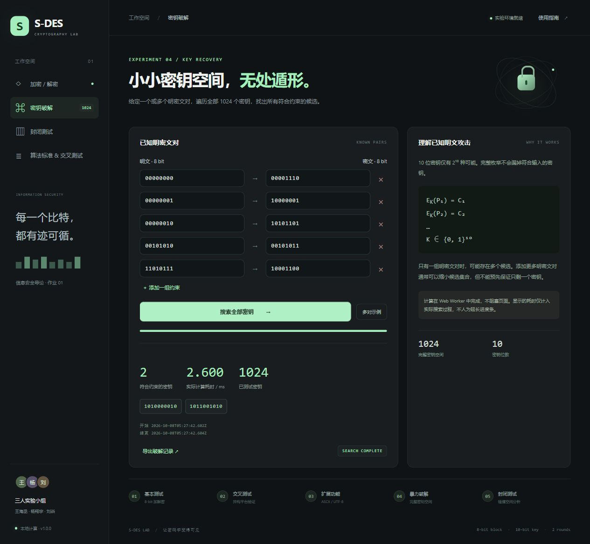
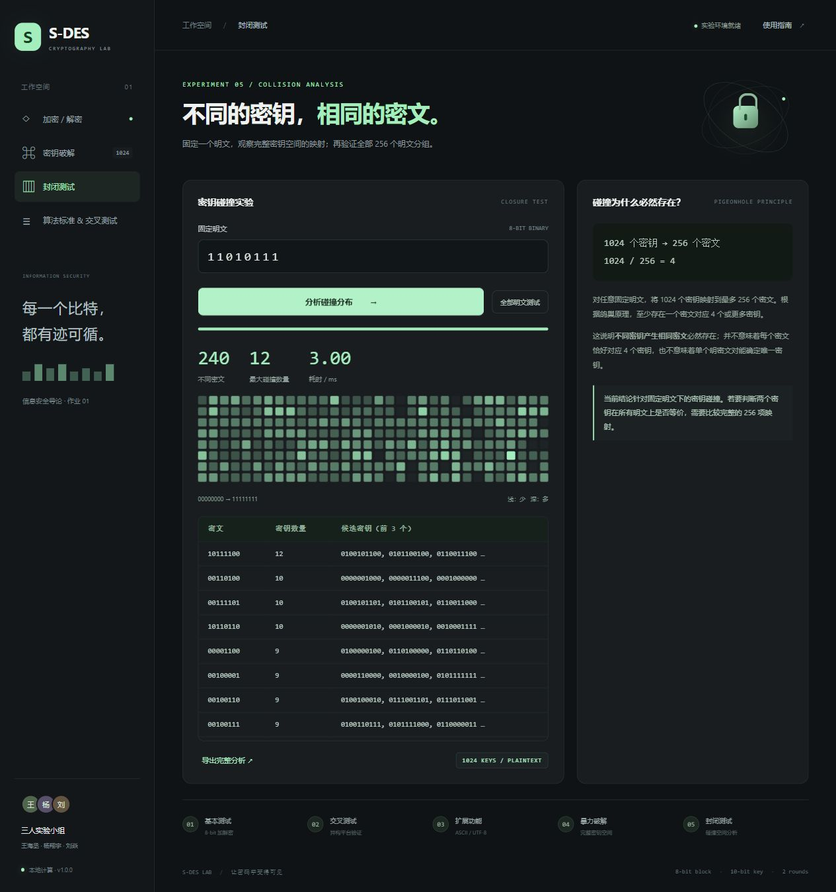
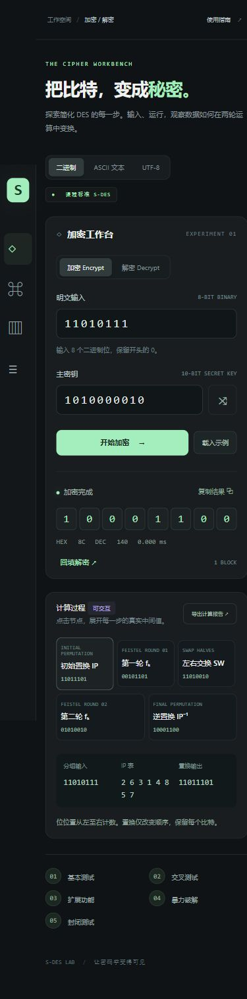

# 界面验收记录

2026-10-08，真实浏览器访问 http://localhost:4173，桌面默认视口。

| 场景 | 实测结果 |
| --- | --- |
| 8-bit 加密 | 11010111 / 1010000010 → 10001100，Hex 8C，DEC 140 |
| 逐轮展开 | 第一轮 L/R=1101/1101，E/P=11101011，异或=01001111，S 盒=11/11，P4=1111，输出=00101101 |
| 回填解密 | 10001100 → 11010111 |
| ASCII 示例往返 | Hello, S-DES! → C4 F8 0D 0D 2F 99 62 4F 36 5F 50 4F 29 → 原文 |
| UTF-8 中文/emoji 往返 | 你好，S-DES 🔐 原样恢复 |
| 错误位数 | 输入 101，显示“明文必须为 8 位二进制，只能包含 0 和 1。” |
| 多对密钥破解 | Worker 完整搜索 1024，得到 1010000010、1011001010 两个候选；浏览器实测 2.600 ms |
| 单明文碰撞分析 | 11010111 映射到 240 个不同密文，最大碰撞 12；热力图与表格显示 |
| 全部明文碰撞 | 256 / 256 明文有碰撞，共 262144 映射；浏览器实测 163.70 ms |
| 交叉向量导入 | 从真实文件选择器导入 cross-vectors.json，256 / 256 通过 |
| 手机尺寸 | 390 × 844 视口，结果与计算轨迹正常，页面没有水平溢出 |
| 浏览器日志 | 功能验收后读取 error/warn，未记录错误或警告 |
| 切换页面后的报告 | 未计算时提示“请先完成一次计算”；重新计算后导出结果与 trace.output 一致 |
| 使用指南 | 对话框可打开、关闭，操作说明完整 |
| UTF-8 BOM 回归 | 新增 U+FEFFABC 往返测试，修复 TextDecoder 默认删除开头 BOM 的行为 |

耗时依赖设备、缓存和浏览器时钟精度，记录实际显示值，不能视作固定性能保证。

## 截图

